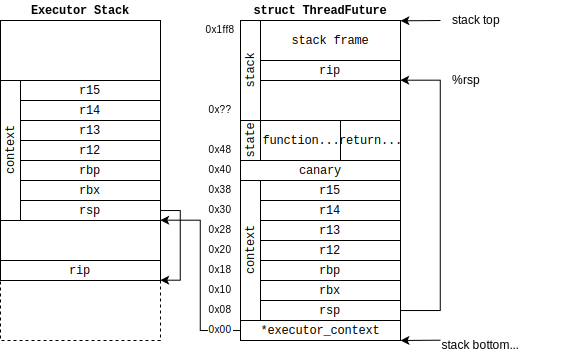

# greenthread-future-rs

[](https://crates.io/crates/greenthread-future)
[](https://docs.rs/greenthread-future)
[](https://github.com/wangrunji0408/greenthread-future-rs/actions)
[](https://coveralls.io/github/wangrunji0408/greenthread-future-rs?branch=master)

Convert closures into futures based on greenthread **on bare-metal (no_std + no_alloc)**.

In a word, this is a `#![no_std]` version of [Futurify](https://github.com/robertohuertasm/futurify).

I'm exploring to use it to implement bare-metal threading.

## Example

TODO. 

Now just take a unit test as an example:

```rust
#[tokio::test]
async fn test() {
  let h1 = tokio::spawn(ThreadFuture::from(|| {
    println!("1.1");
    yield_now();
    println!("1.2");
    1u32
  }));
  let h2 = tokio::spawn(ThreadFuture::from(|| {
    println!("2.1");
    yield_now();
    println!("2.2");
    2u32
  }));
  println!("join 1 => {}", h1.await.unwrap());
  println!("join 2 => {}", h2.await.unwrap());
}
```

Output:

```
1.1
2.1
1.2
2.2
join 1 => 1
join 2 => 2
```

## Internal


